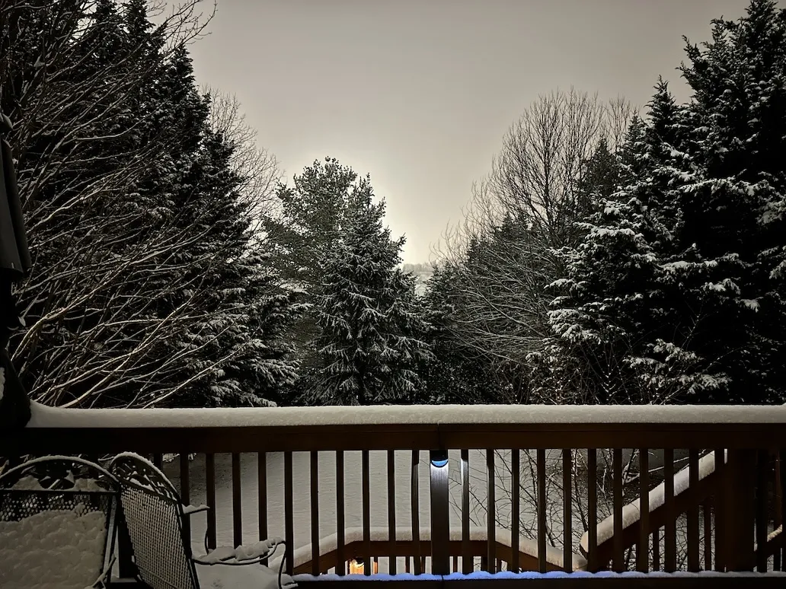

+++
title = 'Update: First Snow'
date = 2024-01-15T23:42:51-05:00
draft = false
subtitle = "There's mooooore!!!"
tags = ['Winter', 'Personal', 'Post Update']
+++

Jan 15, 2024

>This is an update to my last post, [First Snow](/posts/first-snow).

The snow is falling faster now.

<figure>
	
	<figcaption>More snow!!!</figcaption>
</figure>

<a class="button" href="mailto:reply.13a8f@nthp.me?subject=RE%3A%20Update%20First%20Snow"> Reply to this post via email ✉️</a>

For Webmail Users  
Address: <code>reply.13a8f@nthp.me</code> 
Subject: <code>RE: Update First Snow</code>

