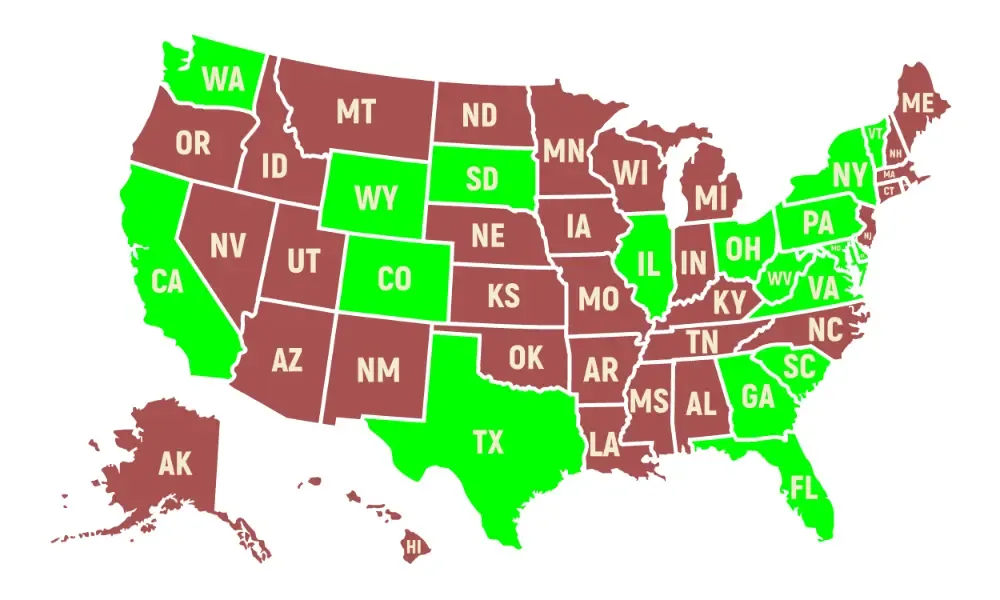
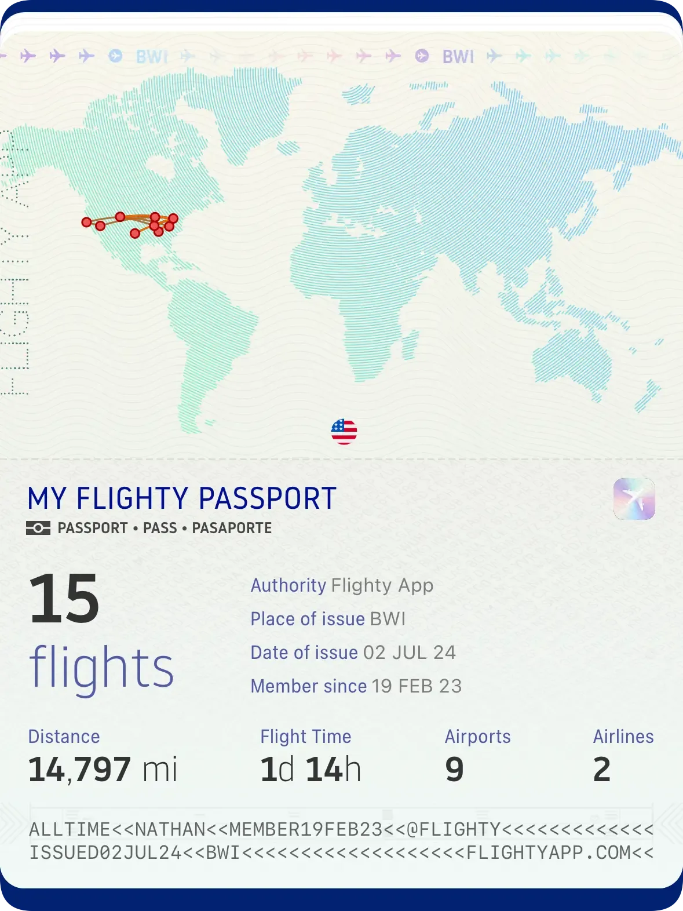

+++
title = 'States'
date = 2023-11-05T20:22:06-05:00
draft = false
+++

	

This is a map of states that I have been to. This does not count states that I have only driven through, or only changed planes in.

<picture>
  <source srcset="PassDark.webp" media="(prefers-color-scheme:dark)">
  
</picture>

These are my commercial flight statistics.

