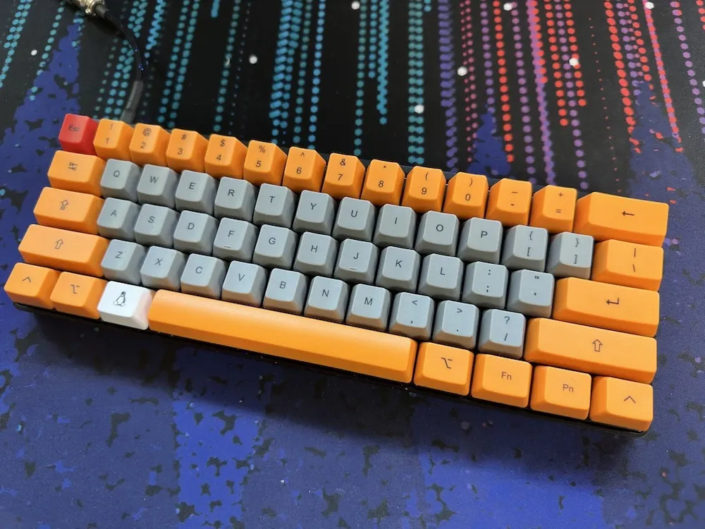
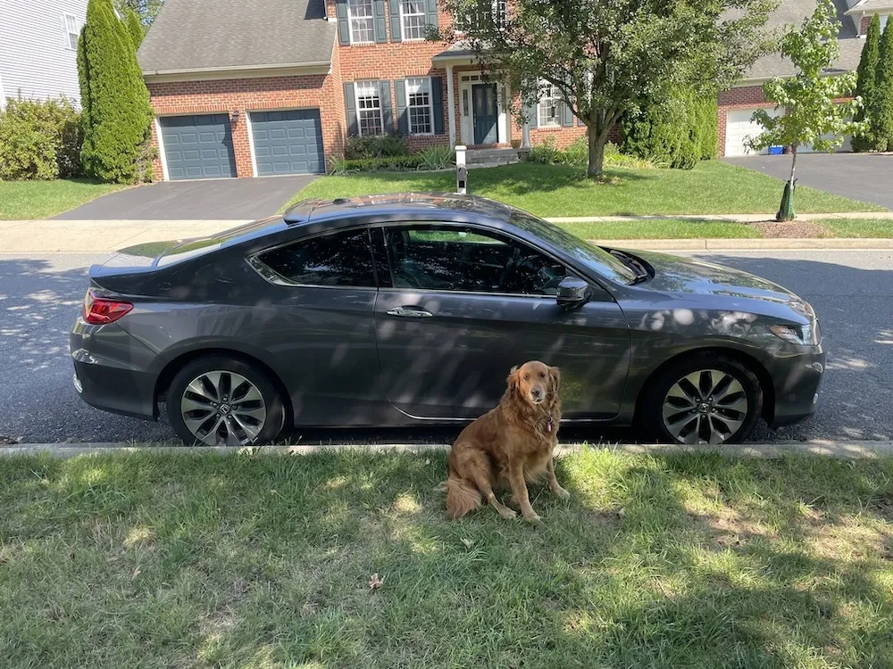

+++
title = 'Things I Use'
date = 2023-11-05T17:49:19-05:00
draft = false
+++

Jump to: [This Website](#site) | [Hardware](#hardware) | [Home Servers](#servers) | [Software](#software) | [Web Tools](#webtools)

For a list of podcasts and blogs I like, go [here](/my-feeds).

<b>Notice:</b> None of these links are affiliate links, I paid for all of the items listed here.

Items with a ❤️ are extra favorites of mine.

	
## This Website [🔗](#site)

---

### Text Editors

Post Writing: [IA Writer](https://ia.net/writer)

Web Development: [NOVA](https://nova.app)

### Look and Feel

CSS: [nthp.me-css](https://github.com/nathnp/nthp.me-css), based off [SimpleCSS](https://simplecss.org)

Footnotes: [LittleFoot](https://littlefoot.js.org)

### Hosting

Version control: [Git](https://git-scm.com) Via [GitHub](https://github.com)

Build Tool: [Hugo](https://gohugo.io)

Web Hosting: [GitHub Pages](https://pages.github.com/) Using This [Workflow](https://github.com/nathnp/Nathans-site/blob/main/.github/workflows/hugo.yml)

## Hardware [🔗](#hardware)

---

Phone: [iPhone 15 Pro](https://www.apple.com/iphone-15-pro/) in Black Titanium w/ 256GB Storage

Tablet: [6th gen iPad mini](https://support.apple.com/kb/SP850?locale=en_US)

Watch: [Apple Watch Ultra](https://support.apple.com/kb/SP879?locale=en_US)

Laptop: [Late 2020 M1 MacBook Pro](https://support.apple.com/kb/SP824?locale=en_US) w/ 16GB Ram and 512GB Storage in Space Gray

E-reader: [2019 Kindle Oasis](https://www.amazon.com/Kindle-Oasis-now-with-adjustable-warm-light/dp/B07GRSK3HC?pd_rd_w=KZl3v&content-id=amzn1.sym.928be83d-9abb-4025-bc6e-e0aed5aed3c9&pf_rd_p=928be83d-9abb-4025-bc6e-e0aed5aed3c9&pf_rd_r=6MDH10KD5AQAYP33BKMG&pd_rd_wg=XT6EB&pd_rd_r=9c237e62-55ed-4220-a06a-012653e728ea&pd_rd_i=B07GRSK3HC&psc=1&ref_=pd_basp_d_rpt_ba_s_1_t) w/ 32GB Storage & No Ads

Monitor: [LG UltraWide 35WN75C](https://www.lg.com/us/monitors/lg-35wn75c-b-ultrawide-monitor)

Keyboard: [WASD VP3 w/ MX Blues](https://www.wasdkeyboards.com/wasd-vp3-61-key-doubleshot-pbt-black-slate-mechanical-keyboard.html)[^1]

Mouse: [Logitech G502 Light Speed](https://www.logitechg.com/en-us/products/gaming-mice/g502-lightspeed-wireless-gaming-mouse.910-005565.html) w/ [Powerplay charging pad](https://www.logitechg.com/en-us/products/gaming-mouse-pads/powerplay-wireless-charging.943-000109.html)

Headphones: Sony Wh1000-XM4[^2]

Gaming: 1TB [Steam Deck OLED](https://www.steamdeck.com/en/oled) modded to 2TB + [PS5](https://www.playstation.com/en-us/ps5/)

VR: [PSVR2](https://www.playstation.com/en-us/ps-vr2/?smcid=pdc%3Aen-us%3Aaccessories%3Aprimary%20nav%3Amsg-hardware%3Aps-vr2) on [PS5](https://www.playstation.com/en-us/ps5/)

Car: 2015 [Honda](https://youtu.be/w9KYDQry2nQ) Accord Coupe EX-L w/ 2.4L I-VTEC w/ CVT[^3]

Geocaching GPS: [GARMIN GPSMAP 64sx](https://www.garmin.com/en-US/p/669284)

Aircraft: DJI [Mavic air 2](https://www.dji.com/mavic-air-2/specs) / DJI [FPV](https://www.dji.com/dji-fpv/specs)

	
### Radio Gear [🔗](#radio)

---

#### Hardware

SDR: [Hackrf One](https://greatscottgadgets.com/hackrf/one/) w/ Portapack H2

AMP: [20db USB powered amp](https://www.ebay.com/itm/225592416788)

Antenna: [ANT 500](https://www.amazon.com/ANT500-Telescopic-Antenna-HackRF-Stick/dp/B01CQYZJV2/ref=sr_1_1?crid=1I8WB55B4S1NJ&dib=eyJ2IjoiMSJ9.A5HO58weoFX6_U0XqiYu-7tEhLpwypt9OY0n52xjB4TOoV9oiiWXImboGEFnuxvOGm6XjWj7FcUsoQxeh1sRvO1xydjl7UuUgP8c5KVq4h5V8Ik9PpLrVSsF_MVrjEQcDHPb5rrFt-UfnWSTmBA2ly6ZAqDGJnOe2y8oDN2NWNLKlIU2fyi83C-b6a154WbP2_U3tjCYurkM75dWO48CdJIKe2xaHzU01-7swqeNGXQ.WKUeLQdp6XxMGwLq_UjZBTvYkPLAIHNJqZkS3xWn3hE&dib_tag=se&keywords=ant500+antenna&qid=1715906519&sprefix=ant500%2Caps%2C91&sr=8-1)

#### Software

SDR Firmware: [Mayhem](https://github.com/portapack-mayhem/mayhem-firmware)

Computer Software: [SDRangel](https://www.sdrangel.org) and [gqrx](https://www.gqrx.dk)

### Home Servers [🔗](#servers)

---

NAS: [Synology DS418](https://global.download.synology.com/download/Document/Hardware/DataSheet/DiskStation/18-year/DS418/enu/Synology_DS418_Data_Sheet_enu.pdf) w/ 8.7 TB storage using [SHR](https://kb.synology.com/en-us/DSM/tutorial/What_is_Synology_Hybrid_RAID_SHR)

DNS: Raspberry Pi 4 w/ 4GB of ram

Home Auto Protocol Translation Server: Raspberry Pi 3

UniFi Console: [UDR](https://store.ui.com/us/en/collections/unifi-dream-router/products/udr) / [Cloudkey Gen 2 Plus](https://store.ui.com/us/en/products/unifi-cloudkey-plus)

VM Server: Old DELL OptiPlex

## Software [🔗](#software)

---

OS: [macOS 14](https://www.apple.com/macos/sonoma/)

Email: [iCloud Mail](https://icloud.com) + [SimpleLogin](https://simplelogin.io)

Cloud Storage: [iCloud](https://icloud.com) + [Synology DSM](https://www.synology.com/en-us/dsm)

This Site: [Hugo](https://gohugo.io) + [Simple.css](https://simplecss.org) hosted on [Github Pages](https://pages.github.com)

DNS: [Pi-Hole](https://pi-hole.net)

VM Server: [ProxMox VE](https://www.proxmox.com/en/proxmox-virtual-environment/overview)

Geocaching Programs: [Cachly](https://apps.apple.com/us/app/cachly-geocaching/id645384141) for iOS, [iCaching](https://apps.apple.com/us/app/icaching/id420484346?mt=12) for Mac

Clipboard History: [Pastebot](https://tapbots.com/pastebot/)

Task Manager: [OmniFocus](https://www.omnigroup.com/omnifocus)

RSS Clients: [NetNewsWire](https://netnewswire.com) on my mac, and [Reeder 5](https://reeder.app) on my iPhone

RSS Sync Service: [Miniflux](https://miniflux.app)

Podcast Client: [Overcast](https://overcast.fm)

Video Downloader: [Downie](https://software.charliemonroe.net/downie)

Video Editor: [Final Cut Pro](https://www.apple.com/final-cut-pro/)

Vid To GIF Convertor: [Apple Compressor](https://support.apple.com/compressor)

Photo Editor: [Affinity Photo 2](https://affinity.serif.com/en-us/photo/)

FTP Client: [Tansmit 5](https://panic.com/transmit/)

Text Editor: [Nova](https://nova.app)

Flight Tracker: [Flighty](https://flightyapp.com) ❤️

## Web Tools [🔗](#webtools)

---

Email to RSS: [Kill The Newsletter](https://kill-the-newsletter.com)

[^1]: 
[^2]: Learn to name stuff Sony
[^3]: With bonus dog, Ruby   
